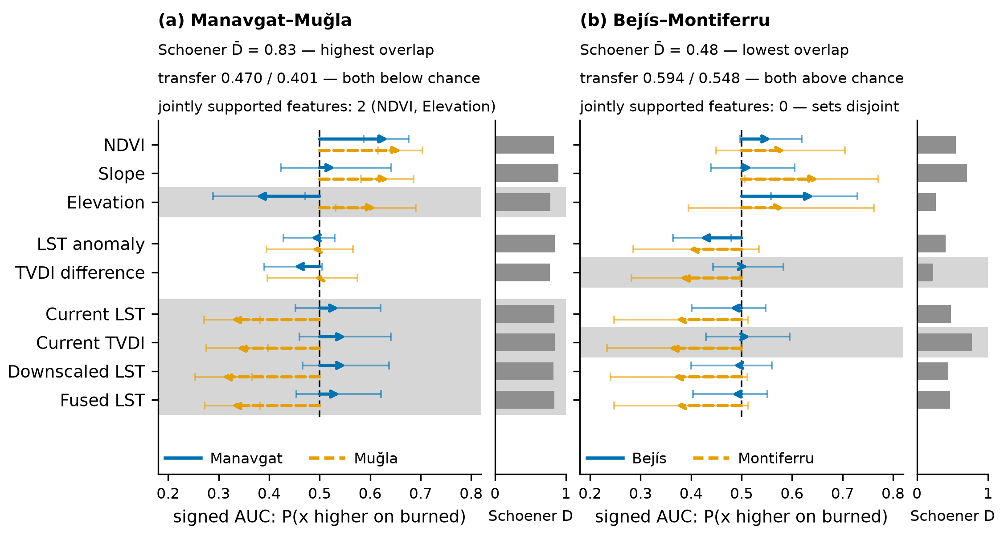
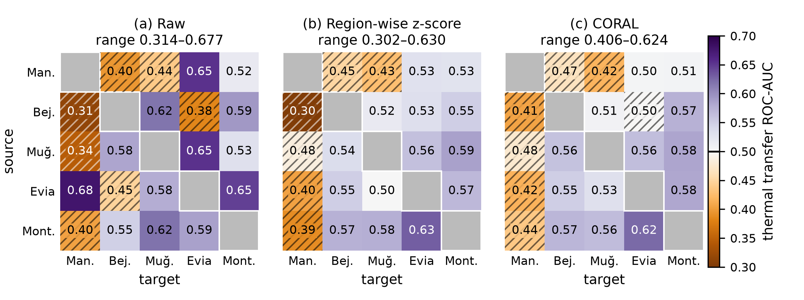

# Evaluation geometry and the limits of cross-region transfer in pre-fire thermal wildfire prediction

Analysis code, frozen outputs and manuscript sources for a study that asks whether pre-fire thermal
predictors, added to a terrain, fuel and greenness baseline, transfer between wildfire regions. Five
Mediterranean fires are compared: Manavgat 2021 and Muğla 2021 (Türkiye), Bejís 2022 (Spain), North
Evia 2021 (Greece) and Montiferru 2021 (Sardinia), with MCD64A1 burned-area labels and spatially
blocked validation. Scoring the same model on the burn scar and its 2 km collar rather than
region-wide costs 0.133 ROC-AUC, and the thermal block adds skill within regions but +0.007
[−0.021, +0.037] across twenty transfer directions. At the point estimates, similarity is neither
sufficient nor necessary: the most niche-similar pair fails both ways (0.438, 0.345), the least
similar transfers above chance (0.594, 0.548).

| Fig. 8. The contrast pairs | Fig. 4. Cross-region transfer, and what label-blind adaptation does to it |
|---|---|
|  |  |

## Repository layout

| Path | Role |
|---|---|
| `paper/00_abstract.md` … `paper/07_declarations.md` | Manuscript, one file per section |
| `paper/supplementary.md` | Supplementary Material: Sections S1–S5, Tables S1–S22 (`paper/SUPPLEMENT_MAP.md` maps former appendix names) |
| `paper/figure_captions.tex`, `highlights.md`, `frontmatter.json`, `REFERENCES.bib` | Captions, highlights, title data, bibliography |
| `paper/figures/` | One script per figure and the graphical abstract, their PDF/SVG outputs, previews and provenance records |
| `paper/code/` | Analysis and verification scripts; `_canonical.py` loads every modelling dataset, checks its SHA-256 and enforces the leakage exclusions |
| `paper/data/<region>/` | The five step8a modelling datasets (Manavgat on the corrected label); for Manavgat also the corrected burned-area raster and the re-freeze manifest |
| `design/` | Design notes for the analysis; where they differ from the manuscript, the manuscript is authoritative |
| `paper/labelfix_rerun/` | **Internal working notes for the label-correction re-run**: round reports, change logs and the outputs every corrected number is read from; `round5/tables/SOURCES.sha256` pins the 49 files the supplementary tables are built from |
| `paper/canonical_rerun/`, `step9g_raw/`, `mugla_*_raw/`, `era5_raw/`, `reproduction_check/` | Frozen pipeline outputs and re-run records the analyses read |
| `paper/tex/` | Build and check tooling and the generated LaTeX and PDFs |
| `paper/submission/` | Submission package: `manuscript.docx`, `supplement.pdf`, `fig1.pdf`–`fig8.pdf`, `graphical_abstract.pdf`, `highlights.txt`; `MANIFEST.md` gives sizes, SHA-256 and the source commit |
| `paper/REFEREE_ROUND_2.md` | Internal pre-submission review record |
| `CLAUDE.md` | **Agent working context, not part of the manuscript** |
| `ENVIRONMENT.md` | The exact Python environment and how it was verified |
| `repo/` | Submodule: the processing pipeline (below) |

## How to run

Set up the environment in [`ENVIRONMENT.md`](ENVIRONMENT.md): Python 3.12.10 with NumPy 2.4.4,
pandas 3.0.2 and scikit-learn 1.9.0. Use those pins rather than the pipeline's `requirements.txt`;
scikit-learn versions differ by about ±0.02 to 0.03 AUC across regions. Run everything from the
repository root.

On Windows, clone to a short path (e.g. `C:\tt`); paths over 260 characters cause spurious check
failures. Some tracked files have long paths, so clone with
`git clone -c core.longpaths=true <url> C:\tt`, or the checkout itself stops partway.

| Command | What it does |
|---|---|
| `python paper/figures/check_all.py` | Runs every figure script, each asserting its plotted values against the frozen outputs and the manuscript text and checking its layout, and `appendix_tables.py`. Committed outputs are restored byte for byte. Exit 0: all pass; 1: a failure; 2: something skipped (Fig. 1 needs cartopy). |
| `python paper/code/appendix_tables.py` | Rebuilds Tables S2–S7 and S9–S18 (176 rows) from their pinned sources and compares them with the text; `--write` rewrites them |
| `python paper/figures/fig4_transfer_matrix.py` (and the other `fig*.py`) | Draws one figure and asserts it |
| `node paper/tex/build_tex.mjs`, `node paper/tex/verify_tex.mjs` | Build the LaTeX; check that every number survives the port and every cross-reference, citation and supplement reference resolves |
| `python paper/tex/build_docx.py` | Builds the Word files (needs `pip install pypandoc_binary python-docx`) |

## Data

The satellite processing pipeline is a separate repository,
[emrehann17/satellite-thermal-digital-twin](https://github.com/emrehann17/satellite-thermal-digital-twin)
(MIT licence), included here as the submodule `repo/`. **Commit of record: `6381f4c`.** All satellite
inputs are public and are retrieved through Google Earth Engine.

The five modelling datasets the analyses read are tracked here, one per region, as
`paper/data/<region>/step8a_500m_modeling_dataset.parquet` (about 27 MB in total). For Manavgat this
is the table on the corrected burned-area label, the official re-freeze (SHA-256 `5a5e876c…`); the
original-label table (SHA-256 `054a1961…`, built on the label exported on 8 July 2026) is not in the
repository and is regenerated by the pipeline. These are the only tracked pipeline inputs;
everything else here is derived from them or
regenerates from the pipeline at `6381f4c`. `paper/code/_canonical.py` loads them and refuses any
file whose SHA-256 differs from the pipeline's record, so a clone runs `check_all.py` without
further downloads. To read a pipeline output tree instead, set `THERMAL_TWIN_DATA` to its root
(`experiments/<region>/step8a/...`); with such a tree, `THERMAL_TWIN_LABELS=frozen` selects the original
Manavgat label instead of the corrected one.

The commit history contains local file paths from the pipeline author's environment; these are
build artefacts, not sensitive data.

## Citation

Metin, E., Cogurcu, Y. E. *Evaluation geometry and the limits of cross-region transfer in pre-fire
thermal wildfire prediction.* Manuscript under review at *Ecological Informatics*.

## Funding

This work was supported by the Çukurova University Scientific Research Projects Coordination Unit
(Bilimsel Araştırma Projeleri Koordinasyon Birimi) under the Career Starter Project (Kariyer
Başlangıç Projesi) scheme, project code FKB-2025-17608 ("Termal Dijital İkiz Tabanlı Sürü İHA
Sistemi ile Orman Yangınlarının Erken Tespiti ve Önlenmesi").

## Acknowledgments

The authors gratefully acknowledge the Çukurova University Scientific Research Projects Coordination
Unit for financial support of this research, and the Department of Computer Engineering at Çukurova
University for providing the laboratory environment and institutional support that made this work
possible.

## AI assistance

During the preparation of this work the authors used Claude (Anthropic) in order to write and run
analysis and verification code against the frozen pipeline outputs, cross-check reported numbers
against those outputs, and draft and edit manuscript text. After using this tool, the authors
reviewed and edited the content as needed and take full responsibility for the content of the
publication.

## Licence

MIT; see [`LICENSE`](LICENSE). The pipeline in `repo/` carries its own MIT licence.
