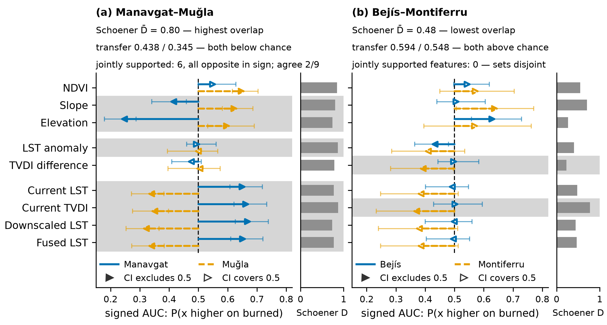
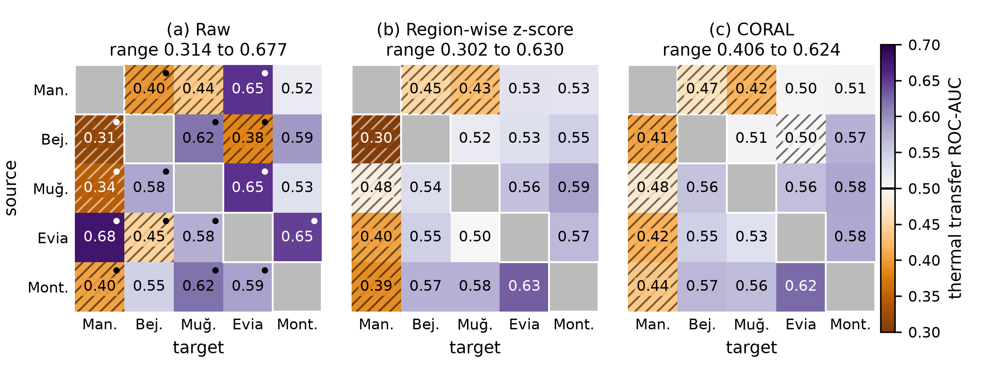

# Evaluation area and the limits of cross-region transfer of pre-fire thermal wildfire models: five large Mediterranean fires

Analysis code, frozen outputs and manuscript sources for a study that tests whether pre-fire thermal
predictors transfer between wildfire regions. Five Mediterranean fires are compared: Manavgat 2021
and Muğla 2021 (Türkiye), Bejís 2022 (Spain), North Evia 2021 (Greece) and Montiferru 2021
(Sardinia, Italy). Burned areas come from MODIS MCD64A1, and all validation is spatially blocked.

Main results:

- When the same model is scored on the burn scar and a 2 km band around it, instead of the whole
  region, 0.133 ROC-AUC is lost over seven scars (0.160 with the region as the unit).
- The thermal predictors add skill within regions, but only +0.007 [−0.020, +0.038] across twenty
  transfer directions (+0.024 [−0.004, +0.049] on comparable study areas).
- Similarity between regions does not predict transfer. The most similar pair fails in both
  directions (0.438, 0.345), and the least similar pair transfers above chance (0.594, 0.548).

| Fig. 8. The contrast pairs | Fig. 4. Cross-region transfer |
|---|---|
|  |  |

## Repository layout

| Path | Content |
|---|---|
| `paper/00_abstract.md` to `paper/07_declarations.md` | Manuscript, one file per section |
| `paper/supplementary.md` | Supplementary Material |
| `paper/figure_captions.tex`, `frontmatter.json`, `REFERENCES.bib` | Captions, title data and bibliography |
| `paper/figures/` | One script per figure, with PDF and SVG outputs, previews and provenance records |
| `paper/code/` | Analysis and verification scripts. `_canonical.py` loads every modelling dataset, checks its SHA-256 and applies the leakage exclusions |
| `paper/data/<region>/` | The five modelling datasets (Manavgat on the corrected label), and for Manavgat the corrected burned-area raster and re-freeze manifest |
| `paper/labelfix_rerun/` | Corrected-label outputs that the reported numbers are read from. `round5/tables/SOURCES.sha256` pins the 49 files the supplementary tables are built from; `exports/SHA256SUMS.txt` pins the released pipeline diagnostics |
| `paper/canonical_rerun/`, `step9g_raw/`, `mugla_*_raw/`, `era5_raw/`, `reproduction_check/` | Frozen pipeline outputs and re-run records |
| `paper/tex/` | `build_docx.py`, which builds the Word files, and the citation style |
| `paper/submission/` | Submission files: manuscript, supplement and figures, with `MANIFEST.md` |
| `step10/`, `experiments/` | Two-region transfer analysis and its outputs |
| `ENVIRONMENT.md` | The Python environment and how it was verified |
| `repo/` | Submodule: the processing pipeline (see Data) |

## How to run

Set up the environment in [`ENVIRONMENT.md`](ENVIRONMENT.md): Python 3.12.10 with NumPy 2.4.4,
pandas 3.0.2 and scikit-learn 1.9.0. Use these versions. Under another scikit-learn version, single
transfer AUCs move by up to about 0.05 (`paper/labelfix_rerun/round7/sklearn152/`). Run all commands
from the repository root.

On Windows, clone to a short path with long paths enabled:
`git clone -c core.longpaths=true <url> C:\tt`.

| Command | What it does |
|---|---|
| `python paper/figures/check_all.py` | Runs every figure script and `appendix_tables.py`. Each script checks its plotted values against the frozen outputs and the manuscript text, and checks its layout. Tracked outputs are restored byte for byte. Exit 0: all pass; 1: a failure; 2: something skipped (Fig. 1 needs cartopy). |
| `python paper/code/appendix_tables.py` | Rebuilds Tables S2 to S7 and S9 to S18 (176 rows) from their pinned sources and compares them with the text |
| `python paper/figures/fig4_transfer_matrix.py` (and the other `fig*.py`) | Draws and checks one figure |
| `python paper/tex/build_docx.py` | Builds the Word files (needs `pip install pypandoc_binary python-docx`) |
| `python paper/code/check_stale_values.py` | Fails if a value that holds only under the original Manavgat label appears without a label |
| `python paper/code/verify_references.py` | Checks every reference DOI against Crossref or DataCite, and every citation key against the bibliography |

## Data

The satellite processing pipeline is a separate repository,
[emrehann17/satellite-thermal-digital-twin](https://github.com/emrehann17/satellite-thermal-digital-twin)
(MIT licence), included as the submodule `repo/`. The Manavgat outputs were re-frozen at commit
`6381f4c`. The other regions' outputs were produced at earlier commits and are reproduced by it. All
satellite inputs are public and are retrieved through Google Earth Engine.

The five modelling datasets are tracked here as
`paper/data/<region>/step8a_500m_modeling_dataset.parquet` (about 27 MB in total). For Manavgat this
is the table on the corrected burned-area label (SHA-256 `5a5e876c…`). The original-label table
(SHA-256 `054a1961…`) is not included and can be regenerated by the pipeline.
`paper/code/_canonical.py` refuses any file whose SHA-256 differs from the recorded value, so a clone
runs `check_all.py` without further downloads. To read a pipeline output tree instead, set
`THERMAL_TWIN_DATA` to its root (`experiments/<region>/step8a/...`).

## Citation

Metin, E., Cogurcu, Y. E. *Evaluation area and the limits of cross-region transfer of pre-fire thermal wildfire models: five large Mediterranean fires.* Manuscript in preparation for submission to *Natural Hazards*.

## Third-party data

The modelling datasets are derived from MODIS (MCD64A1 v061, MOD11A1 v061; NASA LP DAAC), Landsat 8
Collection 2 Level-2 (U.S. Geological Survey), the Copernicus DEM GLO-30 and ESA WorldCover v200, and
remain subject to the terms of these products. WorldCover: © ESA WorldCover project 2021, contains
modified Copernicus Sentinel data (2021) processed by the ESA WorldCover consortium, CC BY 4.0.
Copernicus DEM: produced using Copernicus WorldDEM-30 © DLR e.V. 2010 to 2014 and © Airbus Defence
and Space GmbH 2014 to 2018, provided under COPERNICUS by the European Union and ESA; all rights
reserved. The MIT licence below covers the code, not these data.

## Funding

This work was supported by the Çukurova University Scientific Research Projects Coordination Unit
under its Career Starter Project scheme, project code FKB-2025-17608 ("Early detection and prevention
of forest fires with a thermal digital twin-based UAV swarm system"). The funder had no role in the
study design, analysis, interpretation or the decision to publish.

## Licence

MIT; see [`LICENSE`](LICENSE). The pipeline in `repo/` has its own MIT licence.
